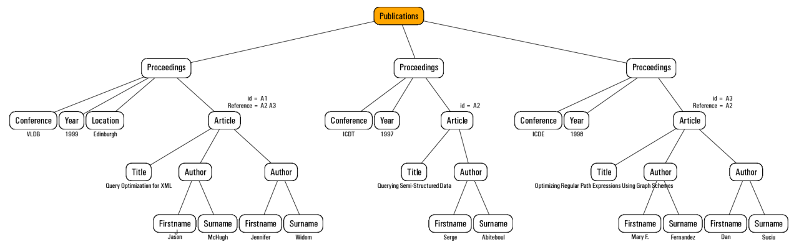

# Aufgabenblatt 6
## XPath Lokalisierung
**Folgende Abbildung visualisiert die Elementknoten eines XML-Dokuments im XPath-Datenmodell. Jeder Knoten ist mit dem Namen des jeweiligen Elementtyps markiert und trägt eine Nummer zur eindeutigen Kennzeichnung.**

**Geben Sie die Knotenmengen an, die folgende XPath-Ausdrücke mit den jeweils angegebenen Kontextknoten ermitteln. Achten Sie dabei auch auf die richtige Reihenfolge auf der jeweiligen Achse.**

| Kontextknoten |	Pfadausdruck           | Knotenmenge |
| :-----------: | :--------------------: | :---------: |
|      8        |      p                 |    10,13    |
|     18        |	ancestor-or-self::sect |  18,14,8,1  |
|     14        |  	.//*                 |
|      3        |	../..//sect/title      |
|     15        |	preceding::em |
|      7        |	//fig        |

---
## XPath-Ausdrücke (1)
**Gegeben ist ein durch ein XML-Dokument beschriebener Baum:**

**Geben Sie jeweils einen XPath-Ausdruck an, um die folgenden Knoten zu selektieren:**
1. **Die Autoren des ersten Artikels.**
 ``/Publications/Proceedings/Artical[1]/Autor/*``
2. **Die Konferenzen, bei der der Autor mit dem Nachnamen Suciu publiziert hat.**
``.//Conference[]``
3. **Alle Proceedings, bei denen Artikel mit mehr als einem Autor publiziert wurden.**
4. **Die Artikel, die sich auf den Artikel mit der ID 'A2' beziehen.**
5. **Die Titel und jeweils der Nachname des ersten Autors aller Artikel.**

---
## XPath-Ausdrücke (2)
**Gegeben ist die XML-Datei personen.xml. Geben Sie jeweils einen XPath-Ausdruck an, um die folgenden Knoten zu selektieren:**

1. **alle ```<person>```-Knoten,**

 //person

2. **alle ```<name>```-Knoten,**

 //name

3. **die Person mit id="EMP02",**

 //person [@id='EMP02']

4. **alle Personen mit Familien-Name: "Chan",**

 //person/name[family='Chan']/given

5. **alle Personen mit Familienname "Chan" oder mit dem Vornamen "Ho" ,**

 //person/name[family='Chan'']/given[given='Ho']

6. **alle Personen mit einem oder mehreren ```<subordinate>```-Knoten (ohne Benutzung der Funktion count),**

 //links[(subordinate)!=0]/ancestor::person

7. **alle Personen ohne Angaben zu ```<subordinate>``` (ohne Benutzung der Funktion count),**

 //links

8. **die Personen-Knoten der Manager von Angestellten, deren Familienname "Law" ist,**

9. **alle Personen, deren Gehalt mehr als 6000 $ beträgt,**

 //person[salary>6000]

10. **die Personenknoten der Manager der zuvor in 9.) selektierten Personen.**

---
## XPath und Musik
**Gegeben ist folgende XML-Datei:**
```
<?xml version="1.0" encoding="ISO-8859-1" ?>
<CDDB>
<!-- Beispiel Musikstücke aus CDDB Datenbank -->
 <komponisten>
  <komponist K_ID="22" vorname="Johann Sebastian" nachname="Bach" geburtsjahr="1685" todesjahr="1750">
   <stueck stueck_ID="1054" titel="Violinkonzert Nr. 1" tonart="a-moll" opus="BWV 1041">
    <aufnahme aufn_ID="1054001" orchester="Les Solistes Romands" dirigent="Arpad Gerecz"/>
   </stueck>
   <stueck stueck_ID="1055" titel="Violinkonzert Nr. 2" tonart="E-dur" opus="BWV 1042">
    <aufnahme aufn_ID="1055001" orchester="Les Solistes Romands" dirigent="Arpad Gerecz"/>
   </stueck>
   <!-- Als Beispiel nur zwei Stücke von Bach -->
  </komponist>
 </komponisten>
 <cds>
  <cd titel="Bach: Violinkonzerte" preis="12.95" gesamtspielzeit="PT61M24S">
   <CDAufnahme aufn_ID="1054001"/>
   <CDAufnahme aufn_ID="1055001"/>
  </cd>
 </cds>
</CDDB>
```
**Geben Sie XPath-Ausdrücke für die folgenden Knotenmengen oder Attributwerte an. Die Ausdrücke sollen für beliebige Dokumente gelten, nicht nur für das Beispieldokument.**
1. **alle Kommentarknoten im gesamten Dokument**

 //comment()
2. **ausgehend von einem Elementknoten vom Typ Aufnahme den Attributknoten mit dem Nachnamen des zugehörigen Komponisten**

 //komponist/@nachname |
3. **die Namen (Attributwert) von allen im Dokument vorkommenden Orchestern**

 //@orchester
4. **alle Stücke (Elementknoten) von Bach in "E-dur"**

 //komponist[@nachname='Bach']/stueck[@tonart="E-dur"]

---
## Yet another XPath exercise
**Gegeben Sei folgende XML-Datei:**
```
<Auftraege>
        <Auftrag>
           <Kunde>Meier</Kunde>
           <PC>pc500</PC>
        </Auftrag>
        <Auftrag>
           <Kunde>Reich</Kunde>
           <PC>pc600</PC>
      </Auftrag>
 </Auftraege>
 ```
* **Welche Knotenmengen werden selektiert durch folgende XPath-Ausdrücke:**
 1. **/Auftraege/Auftrag/PC**

   ``<PC>pc500</PC>; <PC>pc600</PC>``

 2. **//Kunde/.././***

   ``<Kunde>Meier</Kunde>; <PC>pc500</PC>; <Kunde>Reich</Kunde>; <PC>pc600</PC>``

 3. **/Auftraege/Auftrag[Kunde='Meier']**

   ``<Kunde>Meier</Kunde>; <PC>pc500</PC>``

 4. **/Auftraege/Auftrag[Kunde[.='Meier']/..]**

   ``<Kunde>Meier</Kunde>; <PC>pc500</PC>``

 5. **//Auftrag[Kunde and PC]/PC**

   ``<PC>pc500</PC>; <PC>pc600</PC>``

 6. **//*//Auftrag[Kunde='Meier']/Kunde**

   ``<Kunde>Meier</Kunde>``

 7. **//Auftrag[not (Kunde='Reich')][PC != 'pc600']**

   ``<Kunde>Meier</Kunde>; <PC>pc500</PC>``

 8. **/child::Auftraege/child::Auftrag/child::Kunde/following-sibling::*/parent::*/child::***

   ``<Kunde>Meier</Kunde>; <PC>pc500</PC>; <Kunde>Reich</Kunde>; <PC>pc600</PC>``

 9. **/descendant-or-self::PC/preceding::*/ancestor-or-self::***

   ``<Kunde>Meier</Kunde>; <PC>pc500</PC>; <Kunde>Reich</Kunde>; <PC>pc600</PC>;
   <Kunde>Meier</Kunde>; <PC>pc500</PC>
   <Kunde>Meier</Kunde>;
   <PC>pc500</PC>
   <Kunde>Reich</Kunde>; <PC>pc600</PC>
   <Kunde>Reich</Kunde>'``

 10. **/descendant-or-self::Auftrag[../*/PC='pc600']/descendent::***

   keine Ausgabe

* **Welche der XPath-Ausdrücke lassen sich wie vereinfachen, wenn man das konkrete Dokument kennt?**

 1. //PC
 2. //Auftrag oder /*
 3. //Auftrag[Kunde='Meier'] oder //Auftrag[1]
 4. //Auftrag[Kunde='Meier'] oder //Auftrag[1]
 5. //PC
 6. //Auftrag[Kunde='Meier']/Kunde
 7. //Auftrag[Kunde='Meier'] oder //Auftrag[1]
 8. //Auftrag oder /*
 9. //PC/preceding::*/ancestor-or-self::*
 10. keine Ausgabe

* **Welche der XPath-Ausdrücke lassen sich wie vereinfachen, wenn man nur die DTD kennt und die DTD folgendermaßen lautet?**
```
<?xml version="1.0" encoding="iso-8859-1" ?>
<!ELEMENT Auftraege (Auftrag*)>
<!ELEMENT Auftrag (Kunde,PC)>
<!ELEMENT Kunde (#PCDATA)>
<!ELEMENT PC (#PCDATA)>
```

 1. //PC
 2. /*
 3. -
 4. -
 5. //PC
 6. -
 7. -
 8. -
 9. -
 10. keine Ausgabe
